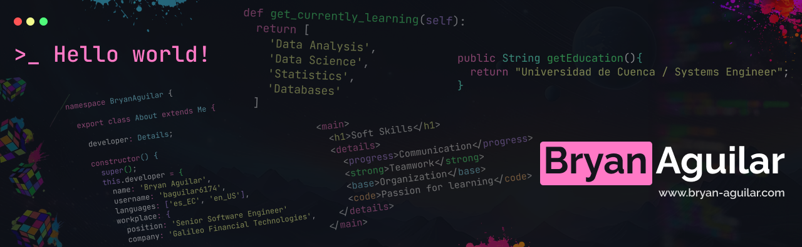

### Hi 👋, my name is [Bryan Aguilar](https://www.bryan-aguilar.com/)

 
  
  
    

 

I am a systems engineer specialized in front-end with more than five years of professional experience. I have worked in software development, mobile app creation, front-end web, but I also have some skills in other fields like backend development and data management.

💻 Frontend Developer / wrangling skills using React / Next.js / Angular / Flutter  
⚙ Backend Developer / wrangling skills using Node / Java / Python / Nest JS  
📖 Enthusiastic Data Analyst & Scientist / SQL / Spreadsheets / Python

- Visit my [website](https://www.bryan-aguilar.com/) and see some of my work
- 🔭 I am working on [Galileo Financial Technologies](https://www.galileo-ft.com/) as `Senior Software Engineer`
- 📫 How to contact me: [bryan.aguilar6174@gmail.com](mailto:bryan.aguilar6174@gmail.com)
- 📝 I write articles on Medium [@baguilar6174](https://baguilar6174.medium.com/) 
- My LinkedIn profile [baguilar6174](https://www.linkedin.com/in/baguilar6174/)

## &#x270d; Blog & Writing

Apart from coding, I also maintain a blog - you can find my articles on my website at [bryan-aguilar.com/blog](https://www.bryan-aguilar.com/blog/) as well as on [Medium](https://baguilar6174.medium.com/).

A sample of my recent articles:

<!-- BLOG-POST-LIST:START -->
- [Java Collections Framework](https://baguilar6174.medium.com/java-collections-framework-ee2fa5fb838f)
- [JavaScript Essentials, Mastering Core Concepts](https://baguilar6174.medium.com/javascript-essentials-mastering-core-concepts-3b1122a3d780)
- [Modern API Development with Node.js, Express, and TypeScript using Clean Architecture](https://baguilar6174.medium.com/modern-api-development-with-node-js-express-and-typescript-using-clean-architecture-0868607b76de)
- [Boilerplate for your Node projects with Express](https://baguilar6174.medium.com/boilerplate-for-your-node-projects-with-express-add98ea89c9f)
- [React Design Patterns](https://medium.com/@baguilar6174/react-design-patterns-6ab55c5ebafb)
<!-- BLOG-POST-LIST:END -->

 

